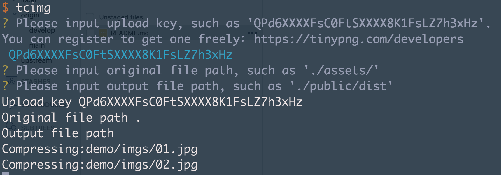

# Tcimg

It's a util depends on the tinypng nodejs. This is a detail doc:
[API Reference](https://tinypng.com/developers/reference/nodejs)

## Usage

1. You should register to get one key freely at first(500 pictures at most one month),
[freely register](https://tinypng.com/developers)

2. Install

  ```<shell>
  yarn add tcimg -g
  ```

  or

  ```<shell>
  npm install tcimg -g
  ```

3. Input the command in command line

```<shell>
tcimg
```

Input the key you get after register successfully



PS: The picture is just a sign, the key is not right.

Cheers~~~
